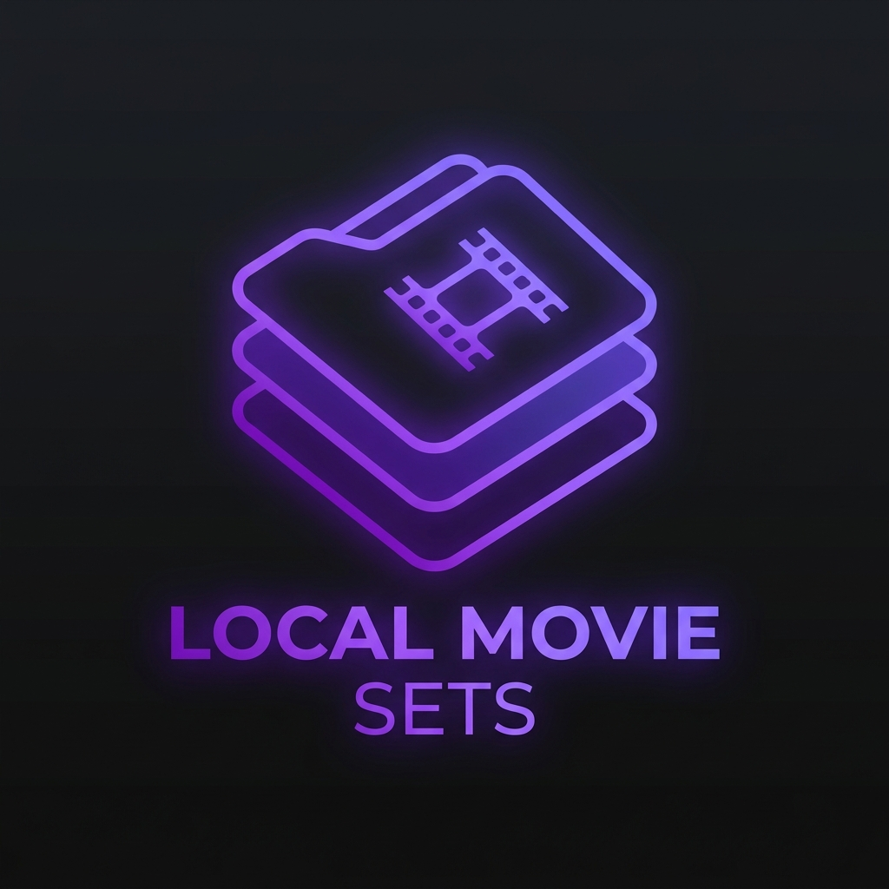
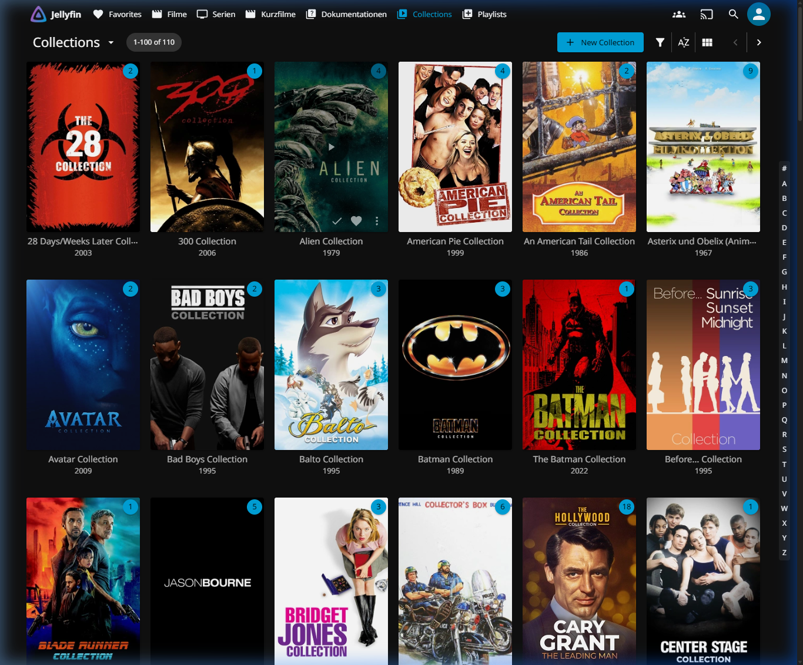
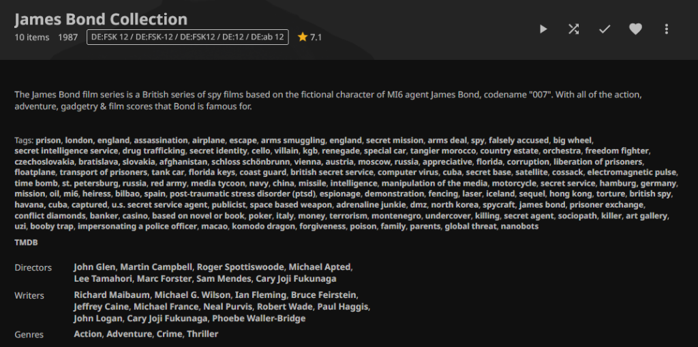
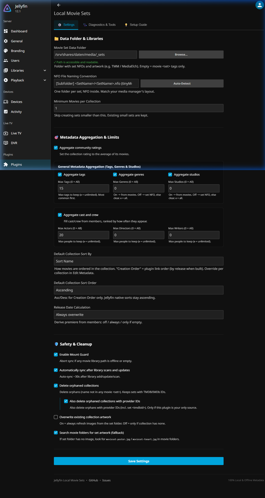
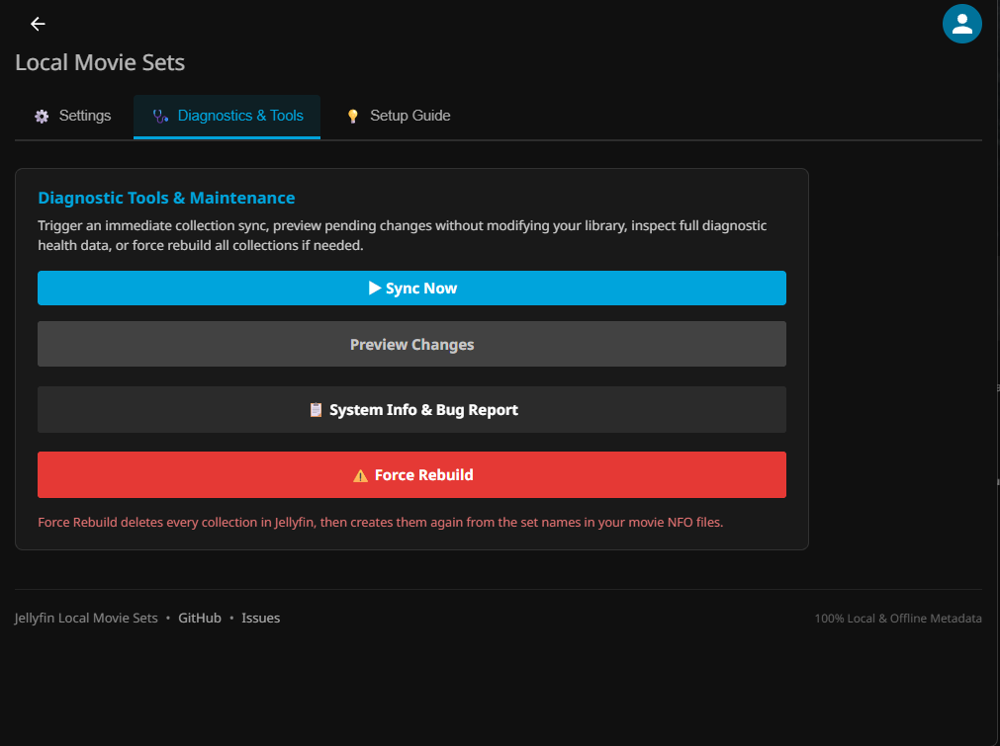
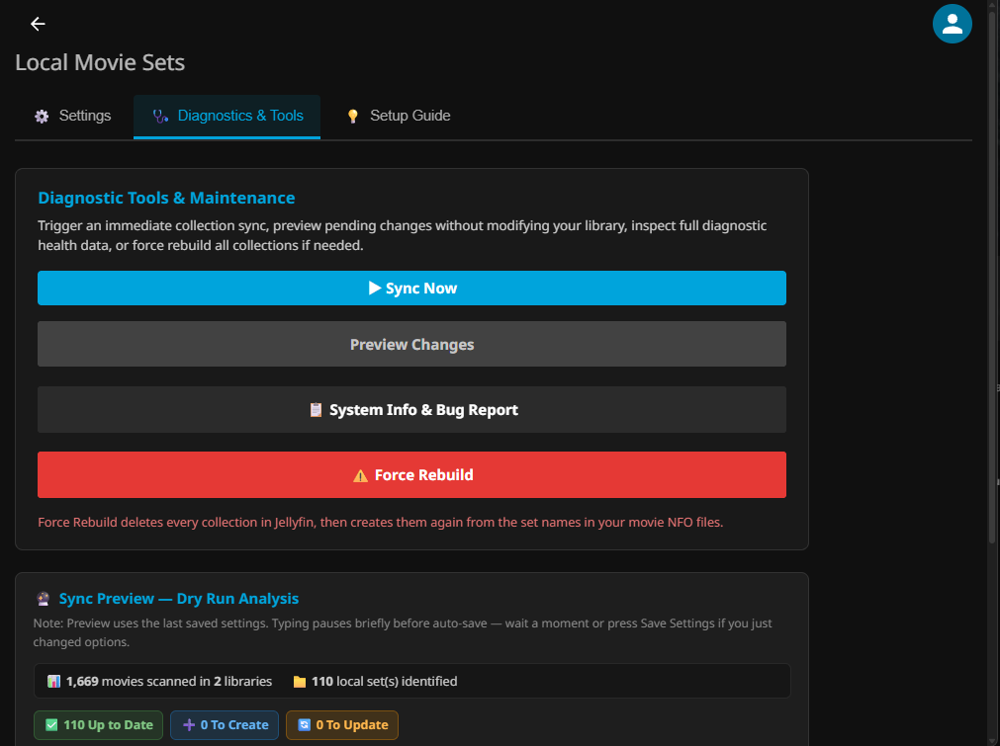
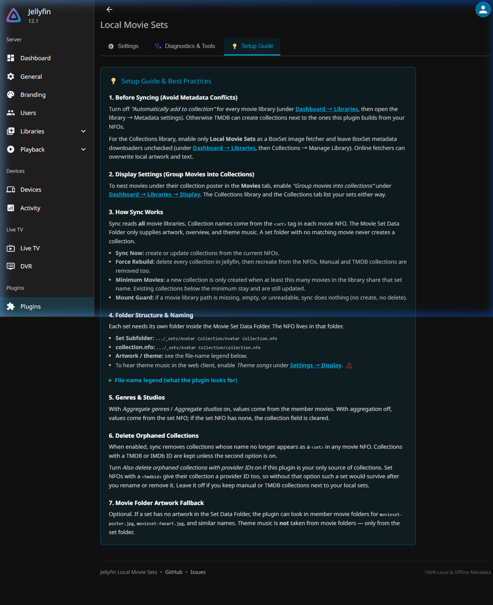

<div align="center">



# Jellyfin Local Movie Sets Plugin

[](LICENSE)
[](https://buymeacoffee.com/gitrys)
[](https://jellyfin.org)

**Creates and manages movie collections (box sets) in Jellyfin using 100% local metadata and artwork produced by media managers such as tinyMediaManager, MediaElch, or Kodi.**  
*Zero external API calls. Zero cloud telemetry. Completely offline and private.*

</div>

---

> [!NOTE]  
> **Vibe-Coded Project Notice**  
> This project is proudly **vibe-coded** — designed and developed through iterative AI-assisted pair programming between a human maintainer and an AI agent. It is crafted with love, rigorously validated against real-world media libraries containing hundreds of movie sets, and specifically engineered to solve genuine community needs that native Jellyfin metadata scrapers leave unaddressed.

---

## Overview

If you curate your media collection using media managers such as [tinyMediaManager (TMM)](https://www.tinymediamanager.org/), [MediaElch](https://mediaelch.github.io/mediaelch-doc/), Kodi, or hand-crafted `.nfo` files, you probably know the frustration: Jellyfin's default collection builder relies on online TMDB lookups, often creating mismatched sets, duplicate franchises, or ignoring your custom artwork and plots.

**Local Movie Sets** solves this permanently by reading the metadata already sitting on your hard drives:

1. **Movie `.nfo` files:** Reads the standard `<set><name>` tags inside each movie's NFO. Collection membership always comes from these tags across **all** movie libraries.
2. **Centralized Set Data Folder:** Each set needs its own subfolder with a set-level `.nfo` (title, overview/plot, studios, genres, sort title) plus poster/fanart and optional `theme.mp3`.
3. **Optional movie-folder artwork fallback:** If enabled in settings, searches member movie folders for `movieset-poster.jpg` / `movieset-fanart.jpg` when the set folder has no image. Theme music is **not** taken from movie folders.

<div align="center">
  
  <p><em>Movie collections generated automatically from local metadata in Jellyfin.</em></p>
</div>

<div align="center">
  
  <p><em>Example: Alien Collection with plot, rating, tags, logo, and member movies populated entirely from local files.</em></p>
</div>

### Plugin configuration

<div align="center">

| ⚙️ Settings | 🩺 Diagnostics & Tools |
|---|---|
|  |  |

| 🩺 Dry-run Preview | 💡 Setup Guide |
|---|---|
|  |  |

<p><em>Three tabs: Settings, Diagnostics &amp; Tools (sync / preview / bug report / rebuild), and Setup Guide (including the file-name legend).</em></p>

</div>

---

## Key Features

- ⚡ **100% Local & Offline:** Never makes outbound calls to TMDB, TVDb, or external servers. Your media collection stays private and works during internet outages.
- 🩺 **Settings, Diagnostics & Setup Guide:** Instant sync, dry-run preview with movie-level diffs and KPI badges, NFO/artwork validation, path checks, Force Rebuild, and an in-plugin setup guide. Settings save automatically after a short pause; **Save Settings** still saves immediately.
- 🛡️ **Mount Guard Protection:** Aborts sync (no create/delete) if a movie library path is missing, empty, or unreadable.
- 📚 **All Movie Libraries:** Scans every movie library; there is no per-library filter in the UI.
- 🔄 **Automatic Background Sync:** Hooks into Jellyfin library events to resync after library scans (with debounce).
- 🕒 **Optional Collection Release Year:** Can date each box set from its oldest or newest member movie — off by default (`Do not calculate`).
- 🎯 **Optional Frequency-Ranked Metadata:** When aggregation is enabled, ranks tags, cast, and crew across member movies with configurable limits (`0` = unlimited). Aggregation is off by default.
- 🏷️ **Genres & Studios:** With aggregation on, values come from member movies. With aggregation off, values come from the set NFO; if the set NFO has none, the collection fields are cleared.
- 🔤 **Custom Collection Sort Title (`<sorttitle>`):** Reads `<sorttitle>` from set NFOs for custom alphabetical ordering (`collection.SortName`).
- 🎵 **Theme Music from the Set Folder:** Copies `theme.mp3` (also `.m4a`, `.flac`, `.ogg`, `.wav`) or prefixed names such as `Alien Collection-theme.mp3` into the Jellyfin collection folder. Enable **Theme songs** in Jellyfin display settings to hear them in the web client.
- 🔔 **Jellyfin Activity Feed Logging:** Posts sync results and warnings to the server activity log.
- 🔒 **Privacy-Safe Bug Report Export:** Interactive export dialog with optional path/title masking for GitHub issues.

---

## Installation

Current releases need **Jellyfin 12**. The last build for Jellyfin 10.10 is [1.0.30.0](https://github.com/gitrys/jellyfin-local-movieset-addon/releases/tag/v1.0.30.0).

### Method A: Via Jellyfin Plugin Repository (Recommended)

1. Open your Jellyfin Web Interface as an administrator.
2. Navigate to **Dashboard → Plugins → Repositories**.
3. Click the **`+`** (Add) button and enter:
   - **Repository Name:** `Local Movie Sets`
   - **Repository URL:**
     ```text
     https://raw.githubusercontent.com/gitrys/jellyfin-local-movieset-addon/main/manifest.json
     ```
4. Click **Save**, then switch to the **Catalog** tab.
5. Locate **Local Movie Sets**, click **Install**, and restart your Jellyfin server.

### Method B: Manual Installation

1. Download the latest `Jellyfin.Plugin.LocalMovieSets_<version>.zip` from [GitHub Releases](https://github.com/gitrys/jellyfin-local-movieset-addon/releases).
2. Extract the archive into your Jellyfin plugins directory:
   - **Linux / Docker:** `/var/lib/jellyfin/plugins/Local Movie Sets/`
   - **Windows:** `%ProgramData%\Jellyfin\Server\plugins\Local Movie Sets\`
3. Ensure file ownership is set to the `jellyfin` user (`chown -R jellyfin:jellyfin ...`).
4. Restart the Jellyfin service.

---

## Configuration & Best Practices

### 1. Essential: Prevent TMDB Auto-Collection Conflicts

Jellyfin has a native setting that automatically creates collections from TMDB metadata upon scanning. To avoid duplicated or conflicted box sets:

1. Go to **Dashboard → Libraries**.
2. For each movie library, click the **`...`** menu → **Manage Library**.
3. Under **Metadata settings**, uncheck:
   > ❌ **Automatically add to collection**
4. Click **Save**.

### 2. Group Movies into Collections in Jellyfin

To make movies collapse under their collection banner in your movie library:

1. Go to **Dashboard → Libraries → Display**.
2. Check:
   >  **Group movies into collections**

### 3. Folder Structure & Naming Conventions

Each set needs its own folder. The NFO file lives inside that folder. Match the plugin's **NFO File Naming Convention** setting to your file structure:

| NFO Naming Option | Expected Path Pattern | Compatibility | Example |
|---|---|---|---|
| **`[Subfolder] <SetName>/<SetName>.nfo`** *(recommended)* | `<SetFolder>/<SetName>/<SetName>.nfo` | tinyMediaManager (TMM) standard | `_sets/Alien Collection/Alien Collection.nfo` |
| **`[Subfolder] <SetName>/collection.nfo`** | `<SetFolder>/<SetName>/collection.nfo` | MediaElch, Ember, Kodi standard | `_sets/Alien Collection/collection.nfo` |

**Artwork files:** Place `poster.jpg` (or `folder.jpg`) and `fanart.jpg` (or `backdrop.jpg`) in the set folder. Optional theme music: `theme.mp3` (or `{folder}-theme.mp3`) in the same folder. For movie-folder artwork fallback, use `movieset-poster.jpg` / `movieset-fanart.jpg` inside member movie folders and keep **Search movie folders for set artwork** enabled.

---

## FAQ & Troubleshooting

### Why do I see duplicate collections?
You likely have Jellyfin's native **"Automatically add to collection"** option enabled on one or more libraries. This causes TMDB to generate online box sets alongside your local ones. Disable this option in your library settings and run **⚠️ Force Rebuild** in the plugin's Diagnostics tab.

### Where should I store my collection artwork?
In the dedicated set data folder (e.g. `_sets/Alien Collection/poster.jpg`). Optionally enable **Search movie folders for set artwork** and place `movieset-poster.jpg` / `movieset-fanart.jpg` in member movie folders. Theme music belongs only in the set folder (`theme.mp3` or a prefixed name).

### Will my collections disappear if my network drive unmounts?
**Mount Guard** (on by default) checks every movie library root before sync. If a root is missing, empty, or unreadable, the sync aborts and leaves existing collections untouched. It does not check the Movie Set Data Folder. Deleting collections that no longer appear in any movie NFO is a separate option and is off by default.

### Does this plugin modify any of my media files?
Your movie and set `.nfo`, video, and image files are only read. Theme audio is copied into Jellyfin's own collection folder. **Force Rebuild** and orphan deletion remove those Jellyfin collection folders, not your media files.

---

## Building from Source

```bash
git clone https://github.com/gitrys/jellyfin-local-movieset-addon.git
cd jellyfin-local-movieset-addon

# Build Release DLL
dotnet build -c Release
```

---

## Support & Buy Me a Coffee

If this plugin saves you time and keeps your movie collections organized, feel free to support development:

[](https://buymeacoffee.com/gitrys)

---

## License

This project is licensed under the **MIT License** — see the [LICENSE](LICENSE) file for details.
