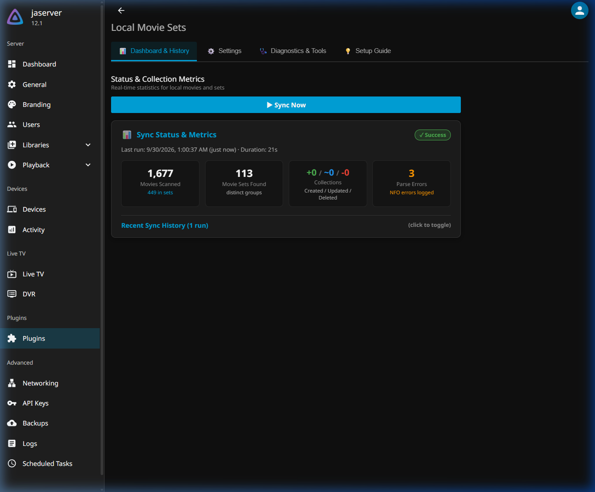
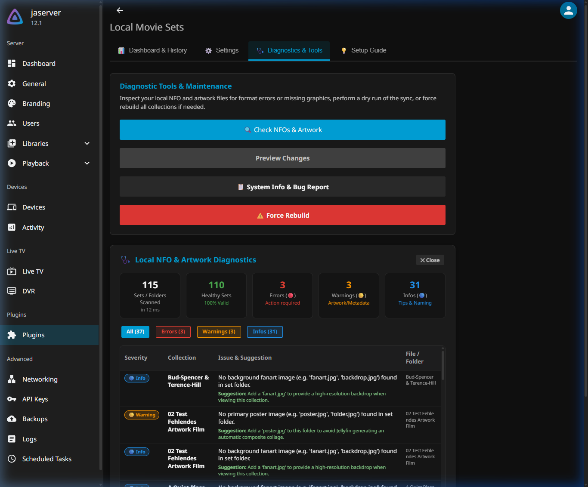

<div align="center">


# Jellyfin Local Movie Sets Plugin

[](LICENSE)
[](https://buymeacoffee.com/gitrys)
[](https://jellyfin.org)

**Creates and manages movie collections (box sets) in Jellyfin using 100% local metadata and artwork produced by media managers such as tinyMediaManager, MediaElch, or Kodi.**  
*Zero external API calls. Zero cloud telemetry. Completely offline and private.*

</div>

---

> [!NOTE]  
> **Vibe-Coded Project Notice**  
> This project is proudly **vibe-coded** — designed and developed through iterative AI-assisted pair programming between a human maintainer and an AI agent. It is crafted with love, rigorously validated against real-world media libraries containing hundreds of movie sets, and specifically engineered to solve genuine community needs that native Jellyfin metadata scrapers leave unaddressed.

---

## Overview

If you curate your media collection using media managers such as [tinyMediaManager (TMM)](https://www.tinymediamanager.org/), [MediaElch](https://mediaelch.github.io/mediaelch-doc/), Kodi, or hand-crafted `.nfo` files, you probably know the frustration: Jellyfin's default collection builder relies on online TMDB lookups, often creating mismatched sets, duplicate franchises, or ignoring your custom artwork and plots.

**Local Movie Sets** solves this permanently by reading the metadata already sitting on your hard drives:

1. **Movie `.nfo` files:** Reads the standard `<set><name>` tags inside each movie's NFO.
2. **Centralized Set Data Folder:** Reads set-level `.nfo` files (with titles, overviews/plots, studios, and genres) alongside collection posters and fanart.
3. **Movie-Folder Fallback:** Searches individual movie folders for `movieset-poster.jpg` and `movieset-fanart.jpg` when no centralized set folder exists.

<div align="center">
  
  <p><em>Movie collections generated automatically from local metadata in Jellyfin.</em></p>
</div>

<div align="center">
  
  <p><em>Example: Alien Collection with plot, rating, tags, logo, and member movies populated entirely from local files.</em></p>
</div>

---

## Key Features

- ⚡ **100% Local & Offline:** Never makes outbound calls to TMDB, TVDb, or external servers. Your media collection stays private and works during internet outages.
- 📊 **Rich Dashboard & Metrics:** Real-time KPI cards display scanned movies, sets detected, collections created/updated/deleted, and NFO errors — persisted across Jellyfin server restarts.
- 🩺 **Local NFO & Artwork Validator:** Scans your set folder and highlights XML syntax issues, missing posters, or missing fanart with actionable suggestions.
- 🛡️ **Mount Guard Protection:** Prevents collections from being emptied or deleted if your NAS, NFS share, or external hard drive is temporarily unmounted or offline.
- 📁 **Selective Library Filter:** Select exactly which movie libraries to scan via convenient checkboxes in the settings UI.
- 🔄 **Automatic Background Sync:** Hooks into Jellyfin's library events to automatically sync movie sets whenever a library scan finishes (with a 30-second debounce).
- 🕒 **Oldest-Movie Release Year:** Automatically dates each collection box set by its oldest movie, enabling perfect chronological sorting in your library view.
- 🔒 **Privacy-Safe Bug Report Export:** Includes an export dialog that strips sensitive file paths and library names so you can safely file GitHub issues.

<div align="center">
  
  <p><em>Plugin Dashboard showing live KPI metrics, sync duration, and status persisted across restarts.</em></p>
</div>

<div align="center">
  
  <p><em>Local NFO &amp; Artwork Diagnostics scanner with status filters and detailed issue suggestions.</em></p>
</div>

---

## Installation

### Method A: Via Jellyfin Plugin Repository (Recommended)

1. Open your Jellyfin Web Interface as an administrator.
2. Navigate to **Dashboard → Plugins → Repositories**.
3. Click the **`+`** (Add) button and enter:
   - **Repository Name:** `Local Movie Sets`
   - **Repository URL:**
     ```text
     https://raw.githubusercontent.com/gitrys/jellyfin-local-movieset-addon/main/manifest.json
     ```
4. Click **Save**, then switch to the **Catalog** tab.
5. Locate **Local Movie Sets**, click **Install**, and restart your Jellyfin server.

### Method B: Manual Installation

1. Download the latest `Jellyfin.Plugin.LocalMovieSets_<version>.zip` from [GitHub Releases](https://github.com/gitrys/jellyfin-local-movieset-addon/releases).
2. Extract the archive into your Jellyfin plugins directory:
   - **Linux / Docker:** `/var/lib/jellyfin/plugins/Local Movie Sets/`
   - **Windows:** `%ProgramData%\Jellyfin\Server\plugins\Local Movie Sets\`
3. Ensure file ownership is set to the `jellyfin` user (`chown -R jellyfin:jellyfin ...`).
4. Restart the Jellyfin service.

---

## Configuration & Best Practices

### 1. Essential: Prevent TMDB Auto-Collection Conflicts

Jellyfin has a native setting that automatically creates collections from TMDB metadata upon scanning. To avoid duplicated or conflicted box sets:

1. Go to **Dashboard → Libraries**.
2. For each movie library, click the **`...`** menu → **Manage Library**.
3. Under **Metadata settings**, uncheck:
   > ❌ **Automatically add to collection**
4. Click **Save**.

### 2. Group Movies into Collections in Jellyfin

To make movies collapse under their collection banner in your movie library:

1. Go to **Dashboard → Libraries → Display**.
2. Check:
   >  **Group movies into collections**

### 3. Folder Structure & Naming Conventions

Match the plugin's **NFO File Naming Convention** setting to your file structure:

| NFO Naming Option | Expected Path Pattern | Example |
|---|---|---|
| **Set Subfolder** *(recommended)* | `<SetFolder>/<SetName>/<SetName>.nfo` | `_sets/Alien Collection/Alien Collection.nfo` |
| **Flat File** | `<SetFolder>/<SetName>.nfo` | `_sets/Alien Collection.nfo` |
| **collection.nfo** | `<SetFolder>/<SetName>/collection.nfo` | `_sets/Alien Collection/collection.nfo` |

**Artwork files:** Place `poster.jpg` (or `folder.jpg`) and `fanart.jpg` (or `backdrop.jpg`) directly in the collection folder. If using movie-folder fallback, name them `movieset-poster.jpg` and `movieset-fanart.jpg` inside the member movie folders.

---

## FAQ & Troubleshooting

### Why do I see duplicate collections?
You likely have Jellyfin's native **"Automatically add to collection"** option enabled on one or more libraries. This causes TMDB to generate online box sets alongside your local ones. Disable this option in your library settings and run **⚠️ Force Rebuild** in the plugin's Diagnostics tab.

### Where should I store my collection artwork?
Either in a dedicated movie set data folder (e.g. `_sets/Alien Collection/poster.jpg`), or directly in each movie's folder (e.g. `movieset-poster.jpg`). If you use the latter, make sure to enable **Movie Folder Fallback** in the plugin settings.

### Will my collections disappear if my network drive unmounts?
No. The **Mount Guard** verifies that library roots are online and non-empty before starting any sync. If a share is unreachable, the sync safely aborts and keeps your existing collections untouched.

### Does this plugin modify any of my media files?
**Never.** Local Movie Sets operates in strict **read-only mode** with respect to your physical files. It never edits, renames, or writes to your `.nfo`, video, or image files on disk.

---

## Building from Source

```bash
git clone https://github.com/gitrys/jellyfin-local-movieset-addon.git
cd jellyfin-local-movieset-addon

# Build Release DLL
dotnet build -c Release
```

---

## Support & Buy Me a Coffee

If this plugin saves you time and keeps your movie collections organized, feel free to support development:

[](https://buymeacoffee.com/gitrys)

---

## License

This project is licensed under the **MIT License** — see the [LICENSE](LICENSE) file for details.
